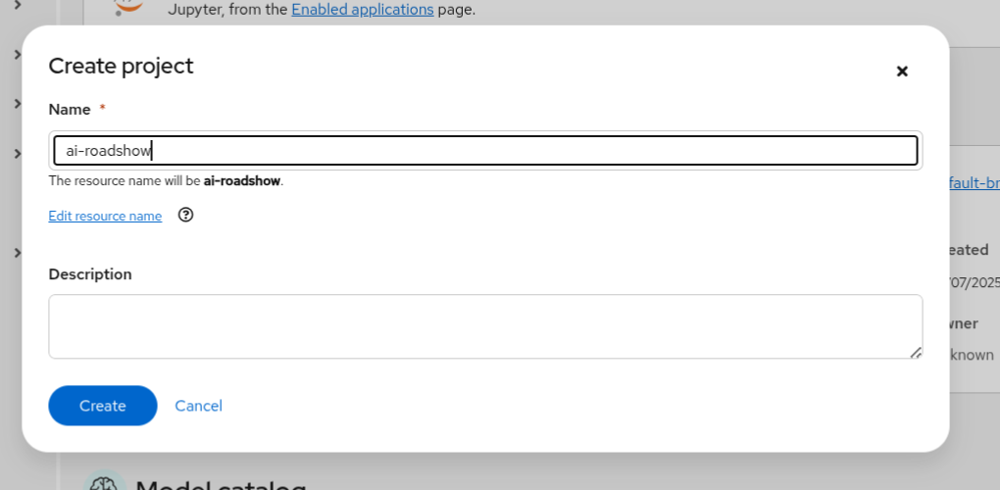
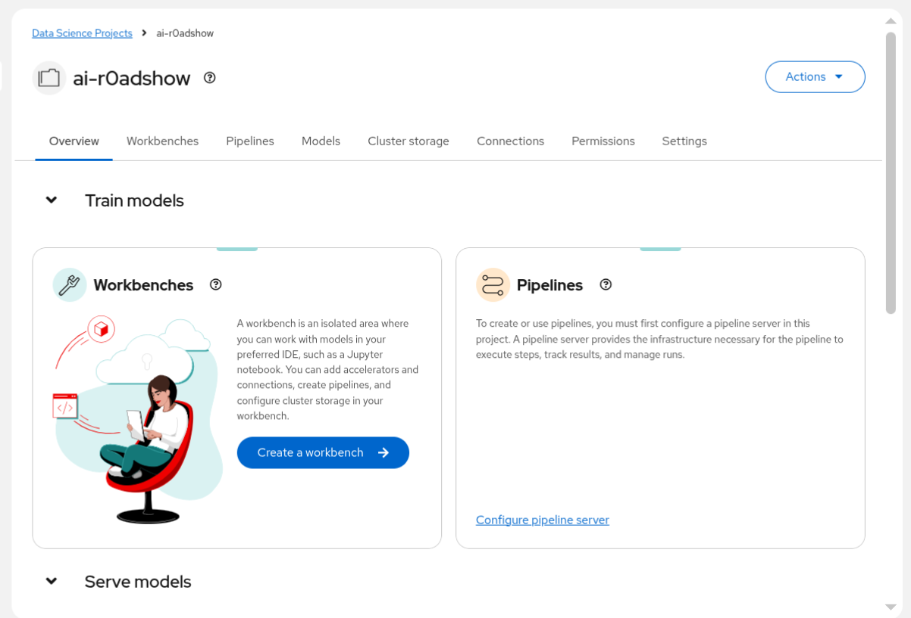

# 🏗️ Create Workspace

After logging in to OpenShift AI, you need to create a project and workspace where you'll work on the activities.

## Create a project

1. Click the **Create project** button on the top right of the display.

2. Type `ai-roadshow` in the **Name** text box.

      

3. Click **Create**

    OpenShift AI creates an empty project.

      

## Create a workspace

1. In your OpenShift AI project, navigate to the **Workspaces** section.

2. Click **Create workspace** or **New workspace**.

3. Configure your workspace with the following settings:

   **Name**: `ai-roadshow-workspace`  
   **Description**: (Optional) Workspace for RHOAI Roadshow activities

4. Click **Create** to create the workspace.

   Your workspace will be created and ready for use.

## Next Steps

Now that you have created your workspace, you're ready to create a workbench. Click the link below to proceed:

* [🖥️ Create Workbench](0-initial-setup/5-create-workbench.md)

